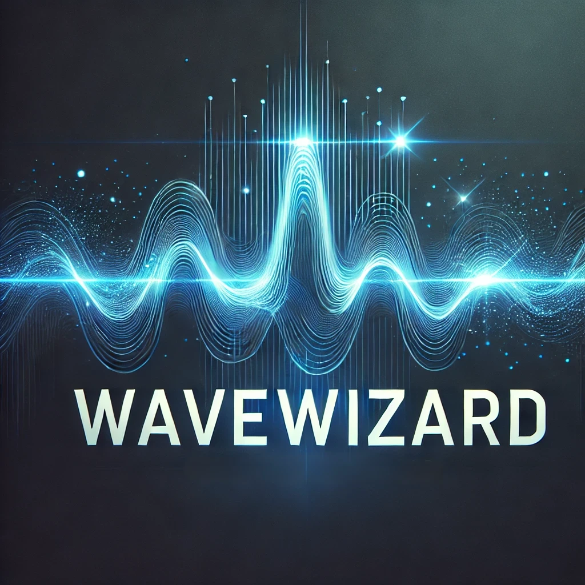
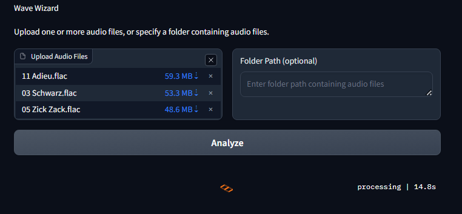
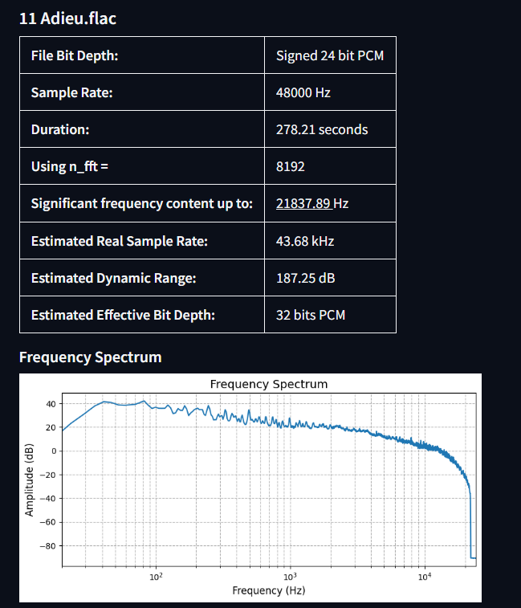
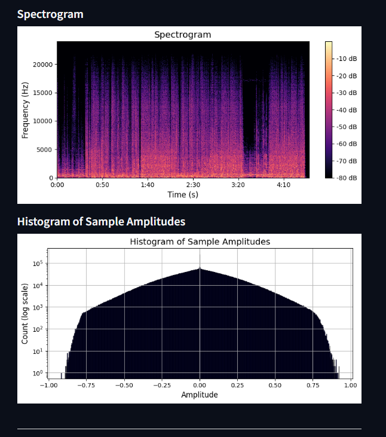
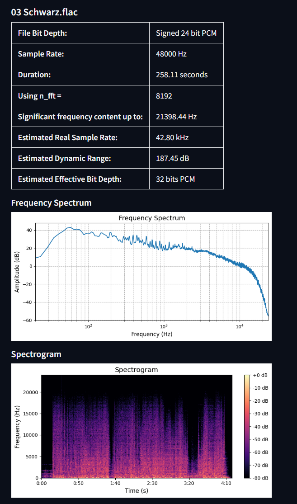

<body>

<h1>🎧 <strong>WaveWizard</strong> 🎶</h1>

<em>Tired of being unsure if your audio files are truly high quality or just upscaled fakes? Discover the truth behind your audio with WaveWizard! Dive deep into the intricate details of your music files and effortlessly uncover their real sample rate, bit depth, and more.</em>

<h2>Overview</h2>

<strong>WaveWizard</strong> is an interactive Gradio app that analyzes audio files to determine their actual sample rate and bit depth. It helps you verify if your high-resolution audio files are genuine or upsampled from lower-quality sources.

<ul>
  <li><strong>Detects true sample rate</strong> by analyzing significant frequency content.</li>
  <li><strong>Estimates effective bit depth</strong> based on dynamic range.</li>
  <li><strong>Visualizes</strong> the frequency spectrum, spectrogram, and amplitude histogram.</li>
  <li><strong>Supports multiple files and folders</strong> for batch processing.</li>
</ul>

<h2>Features</h2>
<ul>
  <li>🎶 <strong>Wveform</strong></li>
  <li>📈 <strong>Spectral Features</strong></li>
  <li>📊 <strong>Frequency Spectrum Analysis</strong></li>
  <li>🌈 <strong>Spectrogram Visualization</strong></li>
  <li>📈 <strong>Amplitude Histogram</strong></li>
  <li>🔍 <strong>Bit Depth and Sample Rate Estimation</strong></li>
  <li>🎛️ <strong>Interactive Gradio Interface</strong></li>
</ul>

<h2>Demo</h2>

  

<em>(Give it a try!)</em>

<h2>Screenshots</h2>
<h3>Interactive Interface</h3>

<h3>Detailed Analysis</h3>

<h2>Installation</h2>
<h3>Prerequisites</h3>
<ul>
  <li><strong>Python 3.7+</strong></li>
  <li><strong>pip</strong> package manager</li>
</ul>

<h3>Clone the Repository</h3>
<pre><code>git clone https://github.com/JackVinati/WaveWizard.git
cd WaveWizard
</code></pre>

<h3>Install Dependencies</h3>
<pre><code>pip install -r requirements.txt
</code></pre>

<strong>Contents of <code>requirements.txt</code>:</strong>

<pre><code>numpy
librosa
matplotlib
soundfile
gradio
</code></pre>

<h2>Usage</h2>
<h3>Running the App</h3>
<pre><code>python wavewizard_app.py
</code></pre>

<h3>Accessing the Interface</h3>

After running the script, open your web browser and navigate to the local URL provided (e.g., <code>http://127.0.0.1:7860/</code>).

<h3>Analyzing Audio Files</h3>
<ol>
  <li><strong>Upload Files:</strong>
    <ul>
      <li>Click on <strong>"Upload Audio Files"</strong> to select one or more audio files.</li>
    </ul>
  </li>
  <li><strong>Specify Folder Path (Optional):</strong>
    <ul>
      <li>Enter the path to a folder containing audio files.</li>
    </ul>
  </li>
  <li><strong>Analyze:</strong>
    <ul>
      <li>Click on the <strong>"Analyze"</strong> button to start the analysis.</li>
    </ul>
  </li>
  <li><strong>View Results:</strong>
    <ul>
      <li>The app displays analysis results, including:</li>
      <ul>
        <li><strong>File Information:</strong> Bit depth, sample rate, duration, etc.</li>
        <li><strong>Plots:</strong> Frequency spectrum, spectrogram, and amplitude histogram.</li>
        <li><strong>Estimations:</strong> Significant frequency content, estimated real sample rate, dynamic range, and effective bit depth.</li>
      </ul>
    </ul>
  </li>
</ol>

<h2>Project Structure</h2>
<pre><code>WaveWizard/
├── wavewizard_app.py     # Main application script
├── requirements.txt          # Python dependencies
├── README.md                 # Project documentation
├── LICENSE                   # License file
└── assets/                   # Images and other assets
</code></pre>

<h2>Contributing</h2>

Contributions are welcome! Please open an issue or submit a pull request for any improvements or feature requests.

<h2>License</h2>

This project is licensed under the <a href="LICENSE">MIT License</a>.

<h2>Acknowledgments</h2>
<ul>
  <li><a href="https://librosa.org/">Librosa</a> for audio processing.</li>
  <li><a href="https://gradio.app/">Gradio</a> for the interactive interface.</li>
  <li><a href="https://matplotlib.org/">Matplotlib</a> for plotting.</li>
</ul>

<h2>Contact</h2>
<ul>
  <li><strong>GitHub:</strong> <a href="https://github.com/JackVinati">@JackVinati</a></li>
</ul>

</body>
</html>
